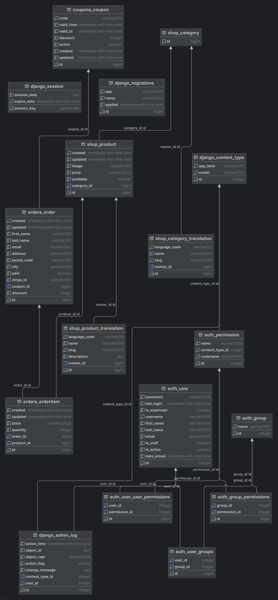

# How to get started with the application 📝


## Run the app 🚀

To run the app locally, follow these steps:

Open your terminal.
1. Navigate to the "projects" directory: `cd ~/projects` (to select this folder, create this directory in your directory or specify any of your previously created ones)
2. Clone the repository: `git clone https://github.com/macalistervadim/django-shop`
3. Navigate to the project directory: `cd myshop`
4. Install `poetry` for your project: `https://python-poetry.org/`
5. Install all requirements: `poetry install`
6. Set up your database: `python3 manage.py migrate`
7. Create a superuser: `python3 manage.py createsuperuser`
8. Create a `.env` file in the root of your project and define your environment variables (see below for example variables)
9. Run RabbitMQ in Docker:
To install and start RabbitMQ locally using Docker, use the following command in docker-console: `docker run -it --name rabbitmq -p 5672:5672 -p 15672:15672 rabbitmq:3-management`
10. Run Celery: To run Celery locally using Docker, use the following command in console: `poetry run celery -A myshop worker -l info`
11. Create your own application in Stripe and enter the webhook secret you need to specify in secrets (env): https://docs.stripe.com/webhooks/quickstart
12. It is also necessary to install the stripe library using the documentation in point 11 and start working with it using the stripe login command, completing all the necessary operations
13. Enable stripe webhook listening: `stripe listen --forward-to localhost:8000/payment/webhook/`
14. Run redis: `docker run -it --name redis -p 6379:6379 redis`
15. Run the development server with HTTP:
`python3 manage.py runserver`
16. Access the app at http://127.0.0.1:8000/ in your browser.

# Important note
Please note that all the following points below are executed strictly in the base directory of the project, in which you have compiled the repository earlier in the paragraph above

## Database
The project uses a ready-made database for educational purposes.

Open your terminal.
1. Perform database migrations:
```
python3 manage.py migrate
```

## Collectstatic

To work correctly and display static files in prod mode, you need to perform a couple of procedures before starting the project

1. Generate static files
```
python3 manage.py collectstatic
```

*note: Please note that the folder where static files will be collected is specified in the project settings under the name "STATIC_ROOT"*

## Environment Variables

The project uses a `.env` file to store confidential or environment variables required for the application to run. Below is the format of the `.env` file.
To get started with the project, you'll need to copy the `.env.example` file and configure it accordingly.

1. Copy the `.env.example` file:
   
   Linux:
   ```bash
   cp .env.example .env
   ```
   Windows:
   ```cmd
   copy .env.example .env
   ```

2. Open the `.env` file and set the required environment variables:
    ```plaintext
    # Example .env file

    # Django secret key
    `DJANGO_SECRET_KEY=your_secret_key_here`
    
    # Django debug
    `DJANGO_DEBUG=True/False`

    # DJANGO allowed hosts
    `DJANGO_ALLOWED_HOSTS=127.0.0.1,localhost`

    # Other environment variables...
    ```

## ER Diagram
Here is a visual ER diagram of the existing project database

